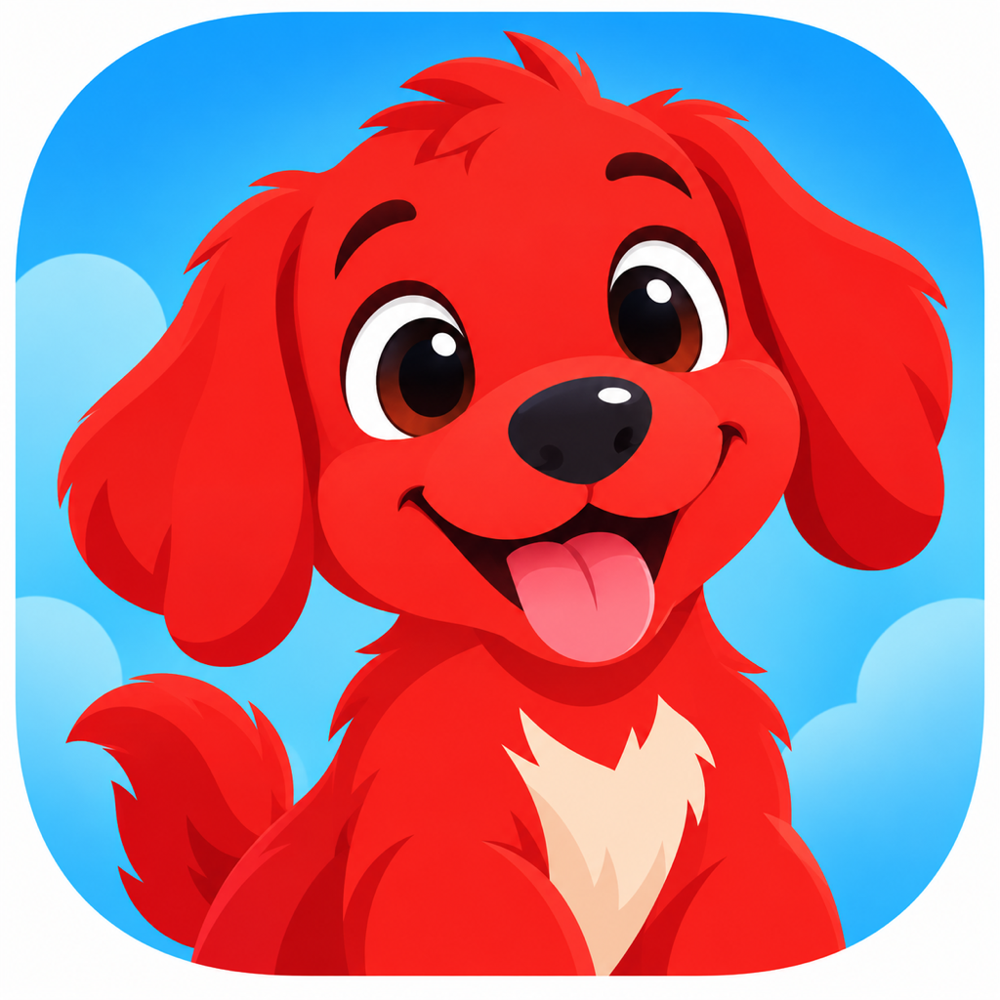
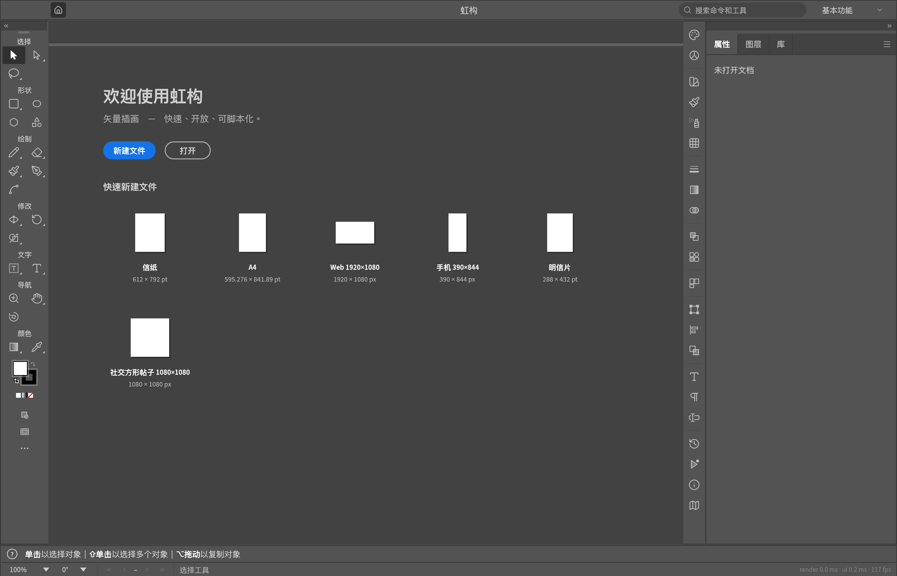

<p align="center"></p>

<h1 align="center">虹构 · Kaleiform</h1>

<p align="center">面向中文创作的免费开源矢量绘图应用</p>

<p align="center">
  <a href="https://github.com/Pengjingyu1992/Kaleiform/releases">下载安装</a> ·
  <a href="docs/installation.md">安装指南</a> ·
  <a href="docs/differences.md">与 VectorCraft 的区别</a> ·
  <a href="ACKNOWLEDGEMENTS.md">致谢</a> ·
  <a href="NOTICE">许可证与署名</a>
</p>

虹构是一款基于 [VectorCraft](https://github.com/storytold/vectorcraft) 的独立衍生项目，
重点打磨中文界面、中文字体与排版体验、紧凑屏幕布局及图片描摹后的交互稳定性。
它不是从零编写的全新绘图引擎，也不是 VectorCraft / ArtCraft 的官方发行版。
上游代码、作者和第三方资产的版权及许可声明均予以保留。

**当前为早期预览版 `0.4.0-kaleiform.2`。** 适合体验、学习与参与开发；重要作品请保留原件并经常另存。
首版提供 **macOS Apple Silicon（M1 / M2 / M3 / M4 等）** 安装包。
源码继承了 Windows、Linux、FreeBSD 和 Web 构建入口，但本项目尚未为这些平台提供经验证的正式安装包。
不要把“源码有构建支持”理解为“所有平台已完成测试”。



## 下载与安装

1. 打开 [Releases](https://github.com/Pengjingyu1992/Kaleiform/releases)，选择最新的虹构预览版。
2. Apple Silicon Mac 下载 `kaleiform-0.4.0-kaleiform.2-macos-arm64.dmg`。
3. 打开 DMG，将 **虹构.app** 拖入 **Applications / 应用程序**，从应用程序文件夹启动。
4. 首版只有 ad-hoc 本地签名，**没有 Apple Developer ID 签名或公证**。如果 macOS 拦截，
   先核对下载来源和 SHA-256，再按系统提示前往“系统设置 → 隐私与安全性 → 仍要打开”。
   不需要关闭系统的全局安全检查。具体步骤及 ZIP 备选见 [安装指南](docs/installation.md)。

中文系统会自动使用中文；也可以在“语言 / Language”菜单或“首选项 → 用户界面 → 语言”选择“简体中文”。
首版不额外打包 craft-fonts 中文字体，中文通过已安装的系统字体回退显示；macOS 通常使用苹方等系统字体。
这些系统字体不包含在我们的下载包中。源码构建可选择嵌入具有再分发许可的 craft-fonts 字体。

## 可以做什么

以下主体能力来自 VectorCraft，我们在此基础上维护中文体验和修复：

- 钢笔、形状、画笔、锚点编辑、路径布尔运算、对齐、图层与画板。
- 填色、描边、渐变、网格、外观、重复、混合和变形等矢量创作功能。
- 文字排版、字体选择，以及上游已有的 CJK 禁则、标点压缩、字间对齐等能力。
- 图片转矢量的图像描摹，包含彩色、灰度、黑白和不同预设。
- SVG / PDF 及 PDF 兼容 `.ai` 的导入导出，以及常见位图输出。
  非 PDF 兼容的专有 `.ai` 内容不保证可读；复杂文件往返也不保证完全无损。
- 撤销重做、原生 JSON 文档、命令行批处理、JSON 控制通道及 MCP。

菜单入口存在不等于所有复杂工作流都已达到专业软件的成熟度。
文件兼容、印前色彩、复杂文字与大型文档请先用副本验证。

## 虹构与 VectorCraft 有什么不同

比较基线为我们实际同步的 VectorCraft 提交
[`8b2be14`](https://github.com/storytold/vectorcraft/commit/8b2be144cc964f9ac26eb175484b887cef0e86db)，
当时工作区版本为 `0.4.0`。发布准备时，上游已推进到 `0.5.0`，本预览版尚未整合那些后续提交；
下表是相对该固定基线的改动，**不是声称领先最新上游的完整功能比较**。

| 方面 | 上游基础 | 虹构在本版本中的重点 |
|---|---|---|
| 项目品牌 | VectorCraft / ArtCraft | 虹构 · Kaleiform 名称、红色小狗 Logo、平台图标与中文 macOS 应用名称 |
| 中文界面 | 上游已包含简体中文和本地化框架 | 保留并整理中文文案、旧语言设置迁移，修复部分悬浮提示未翻译的问题 |
| 中文字体 | 系统 / 可选内嵌字体回退 | 回退时匹配文字字重，区分普通与较粗 UI 字体，改善中西文字体基线一致性 |
| 中文断行 | 已有禁则、Mojikumi 与字间排版 | 补充部分标点禁则，紧急断行保持整形簇边界，避免拆开组合字形 |
| 浮动面板 | 原有面板与停靠系统 | 约束实际可用宽高，增加滚动，防止标题、菜单和关闭按钮挤出面板 |
| 新建文档 | 原有预设和参数面板 | 短屏下预设、参数区可滚动，创建按钮保持可见 |
| 密集描摹 | 原有图像描摹算法与高保真预设 | 减少大选择集的重复菜单检查，限制悬浮几何计算，降低卡顿风险 |
| 忽略白色 | 原有描摹选项 | 修复叠色描摹时底层颜色重新填满白色孔洞的问题，并加入回归测试 |
| 异常 PDF 导出 | 原有 PDF 导入与导出库 | 拦截超出安全范围的路径坐标，避免已复现的整数溢出退出；被省略的图形会产生警告 |
| 对外链接 | 原有社区 / 品牌入口 | 移除原产品的推广入口；文档与法律声明保留上游来源和致谢 |

详细实现位置、验证边界和仍保留的兼容标识见 [差异说明](docs/differences.md)。

## 从源码运行

需要 Git、Rust **1.95 或更高版本**及操作系统的本地编译工具；macOS 安装 Xcode Command Line Tools。

```sh
git clone https://github.com/Pengjingyu1992/Kaleiform.git
cd Kaleiform
cargo run --release --locked -p vectorcraft
```

兼容性原因，Cargo 包名仍为 `vectorcraft`；实际 macOS App 和界面名称是“虹构”。

```sh
cargo xtask bundle       # macOS: dist/虹构.app
cargo xtask ci           # fmt / clippy / test / assets / brands / layers / wasm
```

运行完整检查前安装 `rustup target add wasm32-unknown-unknown`。
其他平台依赖、CLI、Web 与可选中文字体构建见 [安装指南](docs/installation.md) 和
[开发文档](docs/development.md)。

## 隐私与兼容性

- 普通绘图不需要账号或 API key。本发行版没有加入云同步、遥测或自动上传作品的服务。
- 原项目的本地设置、恢复数据和旧格式兼容机制仍保留。与 VectorCraft 同机使用时，
  旧包标识及设置路径可能共享，**不是完全隔离的双应用配置**。升级前请备份作品与设置。
- MCP / 控制通道是可选的本地自动化入口，能够读写文件；只连接可信客户端。
  外接 AI 工具的供应商可能接收数据，这由客户端配置决定，不属于“绝不联网”的保证。
- 发布采用独立清洁快照；没有携带开发机的旧 Git 历史、个人文档、设置、日志或凭据。
  编译产物会去除本机路径，下载包附 SHA-256。检查范围见 [发布隐私说明](docs/privacy.md)。

发现问题请提交 [Issue](https://github.com/Pengjingyu1992/Kaleiform/issues)，不要附带 API key、
私人作品或未经脱敏的日志。安全漏洞请按 [SECURITY.md](SECURITY.md) 私密报告。

## 致谢与许可证

衷心感谢 **VectorCraft 作者 Brandon Thomas、BFlat，以及 ArtCraft 项目团队**
为开源社区贡献绘图引擎、工具、文档、基础设施与持续维护工作。
没有他们与上游社区的贡献，就没有虹构的起点。
也感谢 VectorCraft 的所有贡献者，以及 Rust、egui / eframe、Vello、Lucide 和字体项目社区。
完整说明见 [ACKNOWLEDGEMENTS.md](ACKNOWLEDGEMENTS.md)。

项目代码按 **MIT OR Apache-2.0** 双许可证开源，可任选其一使用；原作者权利和第三方许可不因改名消失。
第三方图标、字体与依赖遵循各自的许可证，见 [LICENSE-MIT](LICENSE-MIT)、
[LICENSE-APACHE](LICENSE-APACHE)、[NOTICE](NOTICE) 与 [ASSETS.md](ASSETS.md)。
虹构与 VectorCraft / ArtCraft 独立维护，不代表他们背书；也与 Adobe 无隶属关系。
